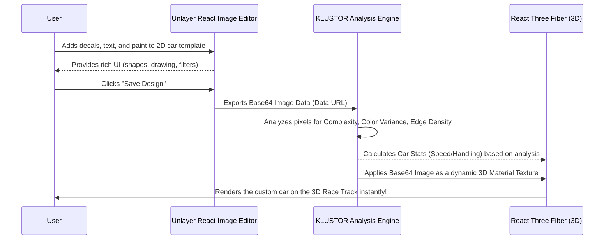
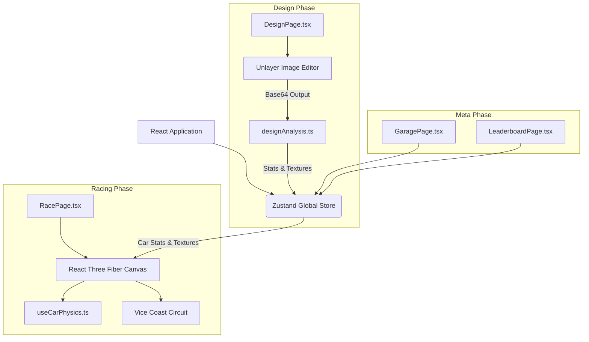

# 🏎️ KLUSTOR

> **Design your ride. Hit the track. More style = more speed.**

**KLUSTOR** is a next-generation, web-based 3D arcade racing game and livery design studio. Built entirely in the browser using **React Three Fiber**, **Three.js**, and the **Unlayer React Image Editor**, it bridges the gap between creative visual expression and high-speed gameplay.

---

## 🎮 The Core Mechanic: "Edit Images to Go Faster"

In most racing games, car customization is purely cosmetic. **In KLUSTOR, your design dictates your performance.**

We built an algorithmic analyzer that reads the 2D canvas data of your custom livery. The more complex, vibrant, and detailed your design is, the higher your **Design Score**.

- **Top Speed** scales with color variance and brightness.
- **Acceleration** improves based on the density of stickers and text.
- **Handling** tightens when you paint over the default template.

**You can't just pick a fast car; you have to *design* a fast car.**

---

## 📸 Gameplay & Mechanics in Action

### 1. The Design Phase & Unlayer Integration


The core of KLUSTOR is powered by the **Unlayer React Image Editor**. Rather than simple color pickers, we provide 5 distinct 2D template faces (Front, Rear, Left, Right, Top) directly inside the browser. 
As players paint, add decals, and manipulate the canvas using Unlayer's robust design tools, the base64 output of the canvas is dynamically exported. The **Live 3D Preview** updates instantly as Unlayer saves the canvas state, translating a pure 2D web-editing experience into a fully wrapped 3D vehicle texture in real-time. Unlayer handles the heavy lifting of canvas layers, grouping, and SVG injections, while our React application catches the raw pixel data outputs to bind them into the Three.js 3D space.

### 2. Algorithmic Design Scoring


Looks aren't just for show. Every time a design is saved from the Unlayer editor, our custom `designAnalysis.ts` algorithm processes the Base64 pixel data byte-by-byte. It runs through an off-screen HTML5 Canvas context to read the raw `ImageData`.
It calculates **Complexity** using a custom edge-detection algorithm, measures **Color Variance** by sampling unique RGB buckets, and counts **Edge Density**.
A highly detailed, vibrant design yields a high **Design Score**, which directly dictates the 3D car's **Top Speed** and **Acceleration** multipliers. The game actively rewards artistic effort with mechanical superiority on the track. If you leave the car blank, your vehicle will be significantly slower.

### 3. Live Multiplayer & Lobby Sync


Players can take their custom-designed rides into live, socket-driven multiplayer rooms. The architecture uses a Node.js/Socket.IO backend to synchronize lobby states, enforce strict design-phase time limits (ranging from 20 seconds to 2 minutes), and broadcast live draft previews of other players' cars in real-time as they edit in Unlayer. Players also identify themselves using a 16-car emoji avatar picker. The backend authoritative state ensures that late-joiners still see the exact synchronized countdown timer.

### 4. High-Speed Racing & Ray-cast Physics


Once the design phase concludes, the game transitions into the 3D track. KLUSTOR uses **React Three Fiber** and a custom arcade-style ray-cast physics engine. It simulates suspension compression, drifting friction, and acceleration curves - all mathematically scaled based on the Unlayer Design Score. 

### 5. Competitive Leaderboards & Crowns


At the end of a multiplayer race, times are submitted to the server. The live leaderboard instantly synchronizes the results, granting a "Crown" (👑) to the overall winner. Your local records are also persisted in the Garage using Zustand, allowing you to track your best laps and visually inspect the specific liveries that set them.

---

## 🧩 How Unlayer Powers the Gameplay

The [Unlayer React Image Editor](https://github.com/unlayer/react-image-editor) isn't just an add-on; it is the core progression engine of the game. We repurpose a powerful image editor into a **3D Texture Painting Studio**.

### The Texture Pipeline



### Detailed Breakdown of the Editor Integration:
1. **Multi-Faced Projection**: The game provides 5 distinct 2D unwrapped templates (Left, Right, Top, Front, Rear). These are SVG templates that map perfectly to the UV coordinates of our 3D model.
2. **Unlayer Initialization**: When a user selects a face, the corresponding blank template is loaded into the `<ReactImageEditor>` component as the background layer.
3. **Creative Freedom**: Users utilize Unlayer's native tools (drawing, adding text, slapping on stickers, and applying filters) to create their livery.
4. **Extraction**: On save, Unlayer compiles the layers and exports a high-resolution base64 data URL.
5. **3D Application**: Three.js takes this data URL, converts it into a `TextureLoader` object, flips the Y-axis to match WebGL coordinates, and applies it to the corresponding face of the `PlayerCar` 3D mesh.

---

## 🏗️ System Architecture

KLUSTOR is built on a modern, fully client-side React stack.



---

## ✨ Feature Deep Dive

### 🎨 The Livery Studio
- Seamlessly switch between 5 different camera angles/faces.
- Live 3D Preview: As you save a face in the 2D editor, the 3D car model rotating next to you updates instantly.

### 🏎️ The Racing Engine
- **Vice Coast Circuit**: A fully realized 3.4km 3D track featuring sweeping turns, tight hairpins, and ocean views.
- **Physics**: Custom-built ray-cast suspension and arcade drifting physics (`useCarPhysics.ts`).
- **HUD & Telemetry**: Dynamic speedometer, RPM gauge, gear shifting logic, and checkpoint split-timing.

### 🏆 Persistent Garage & Leaderboards
- Your best times, designs, and stats are saved locally using Zustand's `persist` middleware.
- Compete on the **Leaderboard** against your own previous ghosts and dummy times.
- **Name Your Ride**: From the Garage, give your custom livery a name that appears on the global time-attack leaderboard.

---

## 🛠️ Tech Stack

- **Core**: React 18, TypeScript, Vite
- **3D Rendering**: Three.js, React Three Fiber, React Three Drei
- **Image Editor**: `@unlayer/react-image-editor`
- **State Management**: Zustand
- **Routing**: React Router v6
- **Analytics**: Vercel Analytics

---

## 🚀 Running Locally

```bash
# 1. Clone the repository
git clone https://github.com/your-username/klustor.git
cd klustor

# 2. Install dependencies
npm install

# 3. Start the Vite development server
npm run dev
```

Open [http://localhost:5173](http://localhost:5173) in your browser. The app runs 100% locally with no backend required.

---

## 🕹️ Game Controls

| Action | Keyboard |
|--------|----------|
| **Throttle (Gas)** | `W` or `Up Arrow` |
| **Brake / Reverse** | `S` or `Down Arrow` |
| **Steer Left** | `A` or `Left Arrow` |
| **Steer Right** | `D` or `Right Arrow` |
| **Editor** | Full Mouse / Touch support for drawing & dragging |

---

## 🗂️ Project Structure

```text
src/
├── components/
│   ├── editor/       # LiveryEditor.tsx (Wraps the Unlayer React Image Editor)
│   ├── ui/           # Buttons, Navbar, Modals
│   └── RaceHUD.tsx   # Speedometer, Timer, and Checkpoints
├── game/
│   ├── components/   # 3D meshes: PlayerCar, ViceCoastEnvironment
│   ├── data/         # viceCoastCircuit.ts (Mathematical spline data for the track)
│   ├── hooks/        # useCarPhysics.ts (Arcade physics), useRaceLogic.ts
│   └── utils/        # designAnalysis.ts (Algorithm converting images to stats)
├── pages/
│   ├── DesignPage.tsx    # Livery Studio + Live 3D Preview
│   ├── RacePage.tsx      # The 3D racing viewport
│   ├── GaragePage.tsx    # Manage car names and view past records
│   └── LeaderboardPage.tsx # View top times
├── store/
│   ├── gameStore.ts      # Zustand state for persisting textures/stats
│   └── telemetryStore.ts # High-frequency store for physics frame-rates
└── types/
    └── index.ts          # Global interfaces
```

---

## 🔗 Credits & Attributions

- **Image Editor:** [Unlayer React Image Editor](https://github.com/unlayer/react-image-editor)
- **3D Framework:** [React Three Fiber](https://docs.pmnd.rs/react-three-fiber/)
- **State:** [Zustand](https://github.com/pmndrs/zustand)
- **Fonts:** Trebuchet MS, Consolas.
